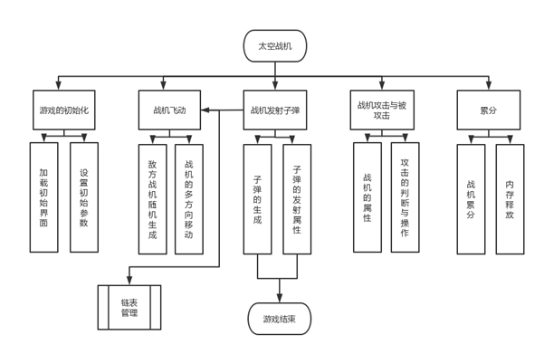

# 太空战机 Space Fighter

### Introduction

UPC大一小学期C++课设 [CodeBlock ](https://www.codeblocks.org/)17.12 +[FunCode](http://www.rgsoft.cn/page41) 实现太空战机

基于所学程序设计课的基础上，在程序设计实训期间，以小组的形式基于FunCode开发平台设计开发一款游戏。

游戏的主要场景是：在外星球上，存在许多不同型号的外形战机，玩家需要通过键盘上的WSAD键控制己方战机，消灭外星球上的邪恶战机。

### Framework

---

### Demo

